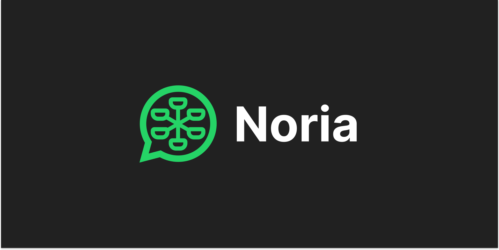
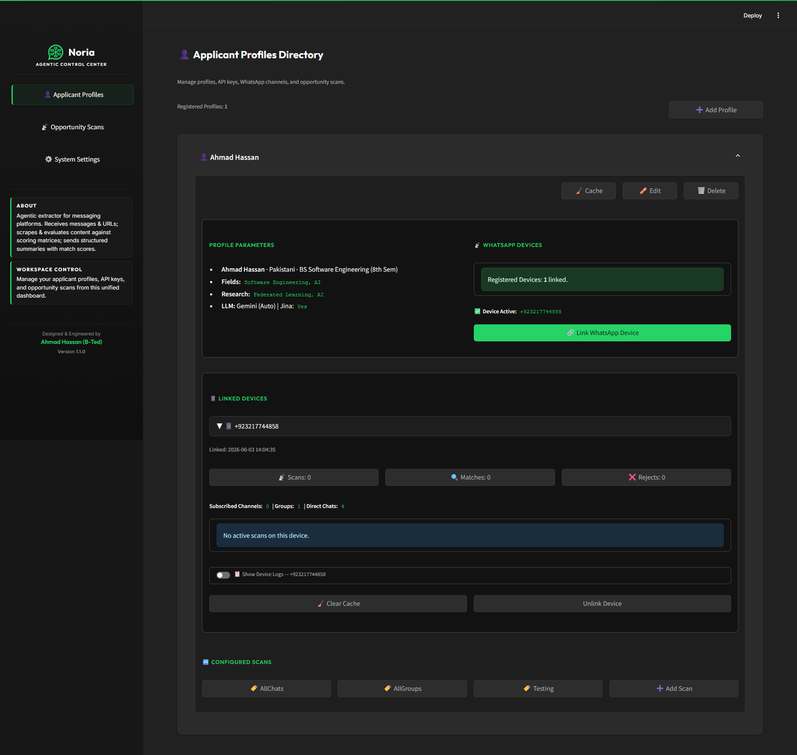
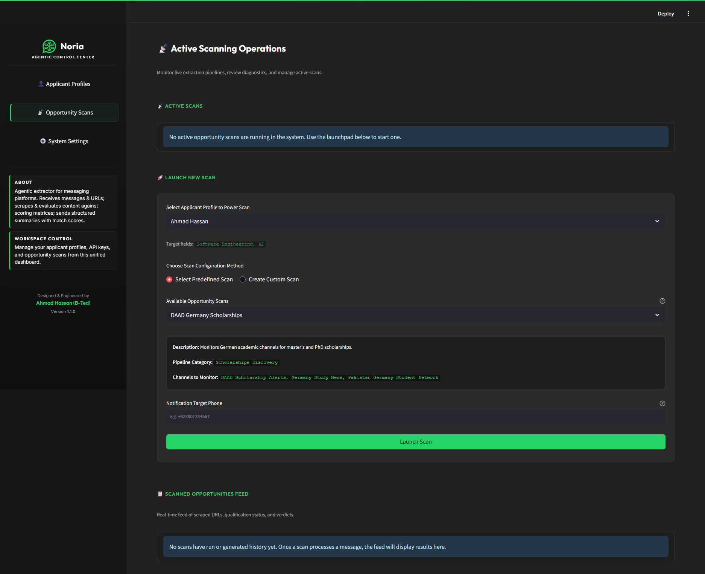
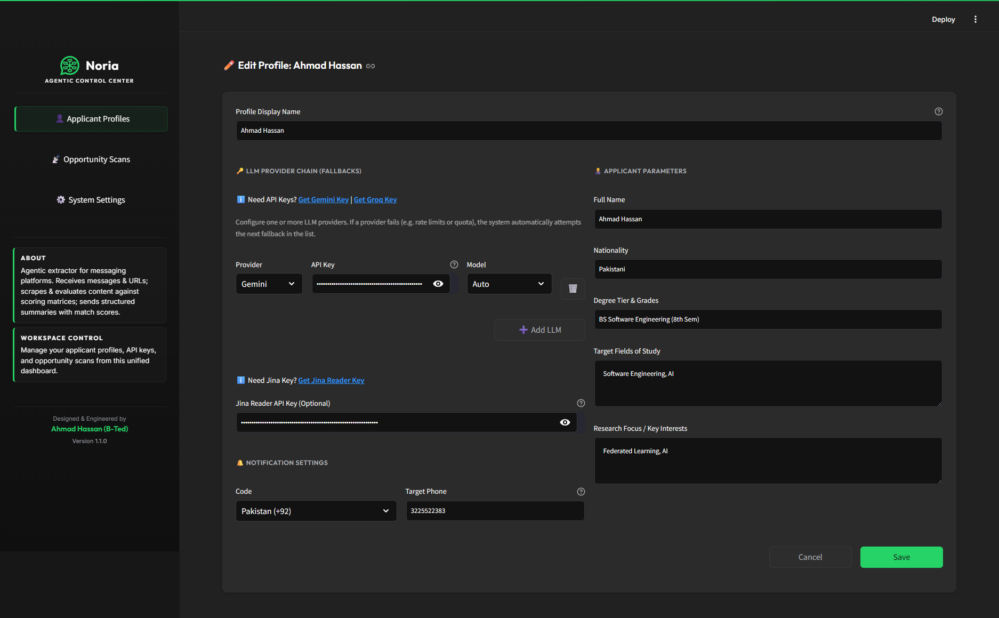
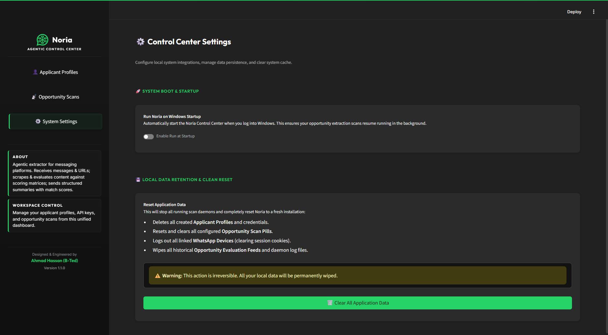
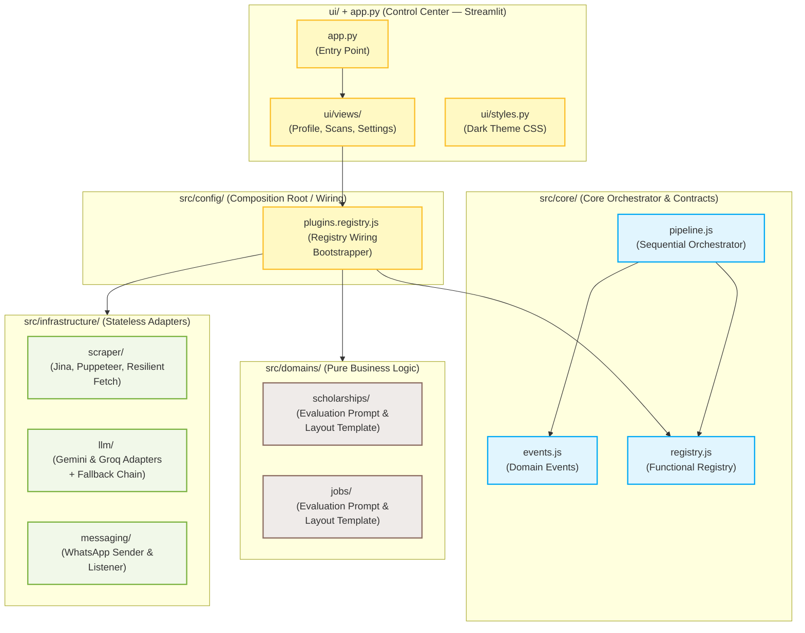
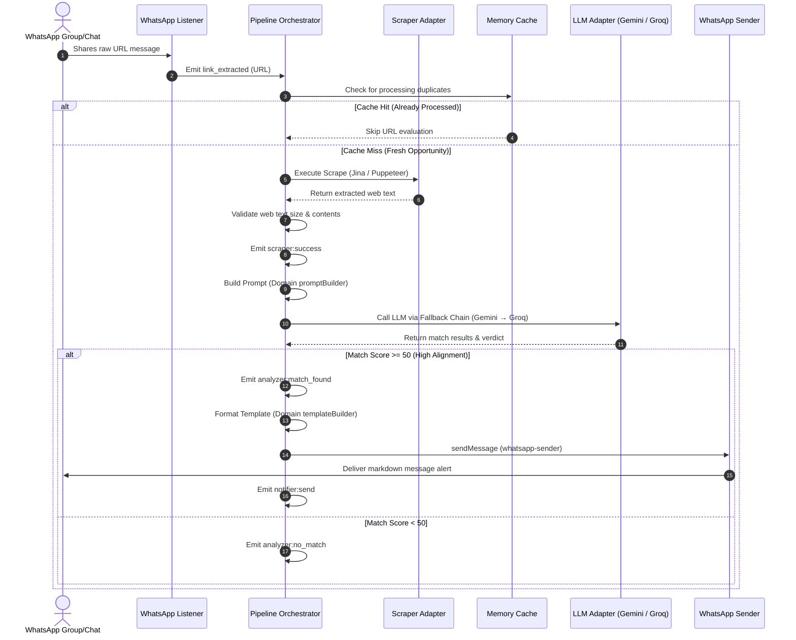

<p align="center">
  
</p>

<p align="center">
  
  
  
</p>


<h1 align="center">NORIA</h1>

<p align="center">
  <strong>A Decoupled, Hexagonal Pipeline Orchestrator for Opportunity Extraction & Generative Evaluation</strong>
</p>

<p align="center">
  Designed and engineered by <a href="https://github.com/AhmadHassan-BTed">Ahmad Hassan (B-Ted)</a>.
</p>

---

## 🌟 The Vision

Opportunities define careers, yet discovery remains a chaotic manual process. Noria was created to bridge this gap. Noria connects humans to life-changing possibilities by crawling raw web pages, executing rigorous AI evaluations against human profiles, and sending real-time alerts. Whether helping students secure fully funded academic scholarships or matching developers with remote job postings, Noria converts raw internet noise into structured opportunities.

---

## 📸 Screenshots

<table>
  <tr>
    <td align="center" width="50%">
      
      <br /><sub><b>Applicant Profiles Directory</b> — manage profiles, linked devices, scan configs, and WhatsApp connections</sub>
    </td>
    <td align="center" width="50%">
      
      <br /><sub><b>Active Scanning Operations</b> — launch scans, select predefined pipelines, and monitor the live opportunity feed</sub>
    </td>
  </tr>
  <tr>
    <td align="center" width="50%">
      
      <br /><sub><b>Profile Editor</b> — configure LLM provider chain, API keys, applicant parameters, and notification targets</sub>
    </td>
    <td align="center" width="50%">
      
      <br /><sub><b>Control Center Settings</b> — Windows startup toggle, local data retention, and full application reset</sub>
    </td>
  </tr>
</table>

---

## 🏛️ Clean Architecture & Boundary Separation


Noria enforces strict Hexagonal Architecture principles, separating core business domains from pluggable technical infrastructure. Dependencies flow strictly inward, managed through a central registry bootstrapper (`src/config/plugins.registry.js`) acting as the composition root.

### Module Relationship & Boundaries



---

## 🔄 System Lifecycle & Request Flow

Noria processes raw internet inputs and coordinates executions dynamically through standard domain events:



---

## ⚙️ Registry Validation

Dynamic verification occurs at boot-time inside the Registry ([registry.js](file:///p:/noria/src/core/registry.js)), which is bootstrapped and wired up by the Composition Root ([plugins.registry.js](file:///p:/noria/src/config/plugins.registry.js)). Registered modules are validated functionally:

<details>
<summary><b>🔍 View Enforced Interface Constraints (Collapsible)</b></summary>

| Registry Category | Target Registration | Mandatory Signature / Keys |
| :--- | :--- | :--- |
| **Domain** | Plain Domain Object | `buildPrompt`, `resolveProfile`, `buildTemplate`, `schema` |
| **Adapter (scraper)** | Plain Scraper Object | `scrape` |
| **Adapter (llm)** | Plain LLM Object | `generateStructuredData` |
| **Adapter (sender)** | Plain Sender Object | `sendMessage` |
| **Listener** | Constructor Class | `initialize()`, `on(event, cb)`, `close()` |

</details>

---

## 📁 Repository Structure

```
noria/
├── app.py                         # Streamlit Control Center entry point
├── run_noria.bat                  # Windows developer launcher
├── run_noria.sh                   # macOS/Linux developer launcher
├── .env.example                   # Environment variable template
├── dist/                          # Compiled Windows executable (Noria.exe)
├── docs/                          # Guides & system architecture docs
│   ├── ARCHITECTURE.md            # Hexagonal Architecture specifications
│   ├── CHANGELOG.md               # Version history
│   └── RELEASE_NOTES_v1.0.0.md   # v1.0.0 release notes
├── pipelines/                     # Declarative YAML pipeline configurations
│   ├── jobs.yaml                  # Job opportunity scan config
│   └── scholarships.yaml          # Scholarship scan config
├── scripts/                       # Build & release tooling
│   ├── build_exe.py               # Compiles Noria.exe via csc.exe
│   ├── launcher.cs                # C# standalone Windows launcher source
│   └── publish_release.py        # GitHub Release publisher (tag + notes + exe)
├── src/                           # Core platform code
│   ├── config/                    # Environment loader & registry wiring
│   ├── core/                      # Pipeline orchestrator, event types, registry
│   ├── domains/                   # Pure business logic (prompts & templates)
│   ├── infrastructure/            # Stateless adapters (Gemini, Groq, Scraper, WhatsApp)
│   ├── queue/                     # Decoupled global event broker
│   ├── utils/                     # Shared helpers (Retry, Cache)
│   └── index.js                   # Node.js boot entrypoint
├── ui/                            # Streamlit Control Center UI
│   ├── styles.py                  # Global dark theme CSS injection
│   ├── components/                # Shared UI components (navigation, etc.)
│   └── views/                     # Page views (profiles, scans, settings)
└── tests/                         # Unit test suite mirroring src/
```

---

## 🚀 Installation & Quickstart

### 1. Requirements
- **Node.js**: `>=22.12.0` (LTS highly recommended)
- **NPM**: `>=10.0.0`

### 2. Setup
Install dependencies:
```bash
git clone https://github.com/AhmadHassan-BTed/Noria.git
cd noria
npm install
```

### 3. Configure
Create a `.env` file from the template:
```bash
cp .env.example .env
```
Provide the required keys — use Gemini, Groq, or both:
```env
# LLM providers (use one or both)
GEMINI_API_KEY=your_gemini_api_key    # https://aistudio.google.com/
GROQ_API_KEY=your_groq_api_key        # https://console.groq.com/

# Optional: faster web scraping
JINA_API_KEY=your_jina_api_key        # https://jina.ai/reader/

# WhatsApp notification target
NOTIFICATION_TARGET=+923001234567

# Active pipelines
ACTIVE_PIPELINES=scholarships,jobs
```

> **Applicant profiles** (name, nationality, degree, fields) are created and managed inside the **Control Center UI** — not in `.env`.

### 4. Run
Start the orchestrated pipelines:
```bash
npm start
```

### 5. Noria Dashboard (Control Center UI)

For a visual administration dashboard, run the Streamlit-based **Noria Control Center**:

#### 🟢 Windows — Standalone Executable (Recommended)
Download and double-click **`Noria.exe`** from the [v1.0.0 Release](https://github.com/AhmadHassan-BTed/Noria/releases/tag/v1.0.0).

The executable is fully self-contained:
- Automatically installs Python and Node.js dependencies on first run
- Starts the Streamlit server in the background
- Opens the Control Center as a **standalone app window** (not a browser tab) via Chrome or Edge `--app` mode
- No `run_noria.bat` or manual setup required

#### 🛠 Windows — Developer Launcher
If running from source, use **[run_noria.bat](run_noria.bat)** from the repo root.

#### 🐧 macOS / Linux — Shell Launcher
Run **[run_noria.sh](run_noria.sh)** in your terminal:
```bash
chmod +x run_noria.sh && ./run_noria.sh
```

From the dashboard you can create applicant profiles, link your WhatsApp by scanning the QR code, configure and trigger scans, and monitor parsed opportunities in real-time.


---

## 🧪 Developer Workflow & Commands

Ensure all local verification checks pass cleanly:

| Command | Objective | Quality Gate Target |
| :--- | :--- | :--- |
| `npm run lint` | ESLint Code Quality | Zero errors or warnings |
| `npm run format:check` | Prettier Layout Verification | Compliant with project styles |
| `npm test` | Jest Unit Tests Execution | All 223 tests passing |
| `npm run test:coverage` | Test Coverage Telemetry | Global coverage must be > 90% |

---

<p align="center">
  Made with 💚 by <a href="https://github.com/AhmadHassan-BTed"><strong>Ahmad Hassan (B-Ted)</strong></a>
</p>
