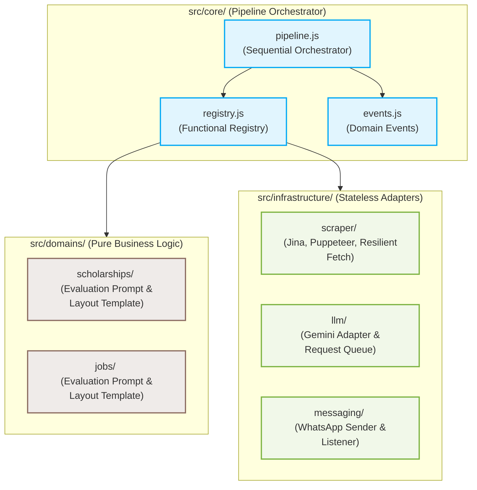
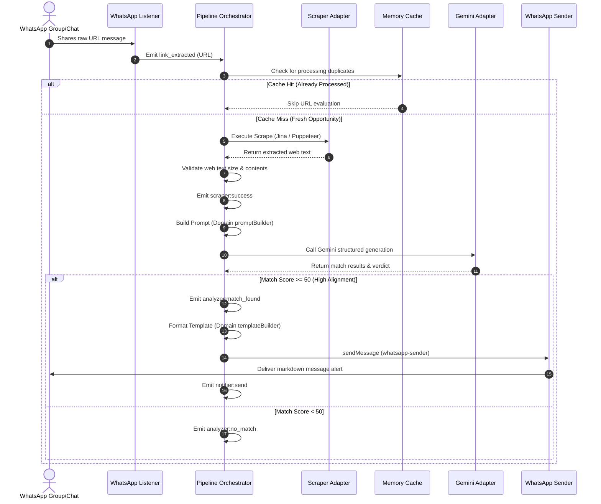

<p align="center">
  
</p>

<p align="center">
  
  
  
</p>


<h1 align="center">NORIA</h1>

<p align="center">
  <strong>A Decoupled, Hexagonal Pipeline Orchestrator for Opportunity Extraction & Generative Evaluation</strong>
</p>

<p align="center">
  Designed and engineered by <a href="https://github.com/AhmadHassan-BTed">Ahmad Hassan (B-Ted)</a>.
</p>

---

## 🌟 The Vision

Opportunities define careers, yet discovery remains a chaotic manual process. Noria was created to bridge this gap. Noria connects humans to life-changing possibilities by crawling raw web pages, executing rigorous AI evaluations against human profiles, and sending real-time alerts. Whether helping students secure fully funded academic scholarships or matching developers with remote job postings, Noria converts raw internet noise into structured opportunities.

---

## 🏛️ Clean Architecture & Boundary Separation

Noria enforces strict Hexagonal Architecture principles, separating core business domains from pluggable technical infrastructure. Dependencies flow strictly inward: `Infrastructure → Core → Domain`.

### Module Relationship & Boundaries



---

## 🔄 System Lifecycle & Request Flow

Noria processes raw internet inputs and coordinates executions dynamically through standard domain events:



---

## ⚙️ Registry Validation

Dynamic verification occurs at boot-time inside the `PluginRegistry` (`src/core/registry.js`). Registered modules are validated functionally:

<details>
<summary><b>🔍 View Enforced Interface Constraints (Collapsible)</b></summary>

| Registry Category | Target Registration | Mandatory Signature / Keys |
| :--- | :--- | :--- |
| **Domain** | Plain Domain Object | `buildPrompt`, `resolveProfile`, `buildTemplate`, `schema` |
| **Adapter (scraper)** | Plain Scraper Object | `scrape` |
| **Adapter (llm)** | Plain LLM Object | `generateStructuredData` |
| **Adapter (sender)** | Plain Sender Object | `sendMessage` |
| **Listener** | Constructor Class | `initialize()`, `on(event, cb)`, `close()` |

</details>

---

## 📁 Repository Structure

```
noria/
├── docs/                          # Guides & system architecture docs
│   └── ARCHITECTURE.md            # Detailed Hexagonal Architecture specifications
├── pipelines/                     # Declarative YAML workflow configurations
│   ├── jobs.yaml                  # Crawler stage coordinates for Jobs
│   └── scholarships.yaml          # Crawler stage coordinates for Scholarships
├── src/                           # Platform code
│   ├── config/                    # Environment settings loader & registry wiring
│   ├── core/                      # Pipeline orchestrator, event types, registry
│   ├── domains/                   # Pure business logic prompts & notification templates
│   ├── infrastructure/            # Stateless adapters (LLM, Scraper, WhatsApp)
│   ├── queue/                     # Decoupled global event broker
│   ├── utils/                     # System-wide helper libraries (Retry, Cache)
│   └── index.js                   # Boot entrypoint
└── tests/                         # Unit test suite mirroring src/
```

---

## 🚀 Installation & Quickstart

### 1. Requirements
- **Node.js**: `>=22.12.0` (LTS highly recommended)
- **NPM**: `>=10.0.0`

### 2. Setup
Install dependencies:
```bash
git clone https://github.com/AhmadHassan-BTed/Noria.git
cd noria
npm install
```

### 3. Configure
Create a `.env` file from the template:
```bash
cp .env.example .env
```
Provide the required keys:
```env
GEMINI_API_KEY=your_gemini_api_key
NOTIFICATION_TARGET=your_phone_number
ACTIVE_PIPELINES=scholarships,jobs
```

### 4. Run
Start the orchestrated pipelines:
```bash
npm start
```

---

## 🧪 Developer Workflow & Commands

Ensure all local verification checks pass cleanly:

| Command | Objective | Quality Gate Target |
| :--- | :--- | :--- |
| `npm run lint` | ESLint Code Quality | Zero errors or warnings |
| `npm run format:check` | Prettier Layout Verification | Compliant with project styles |
| `npm test` | Jest Unit Tests Execution | All 223 tests passing |
| `npm run test:coverage` | Test Coverage Telemetry | Global coverage must be > 90% |
