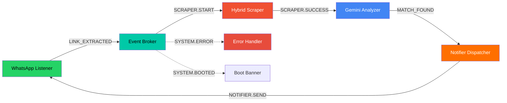
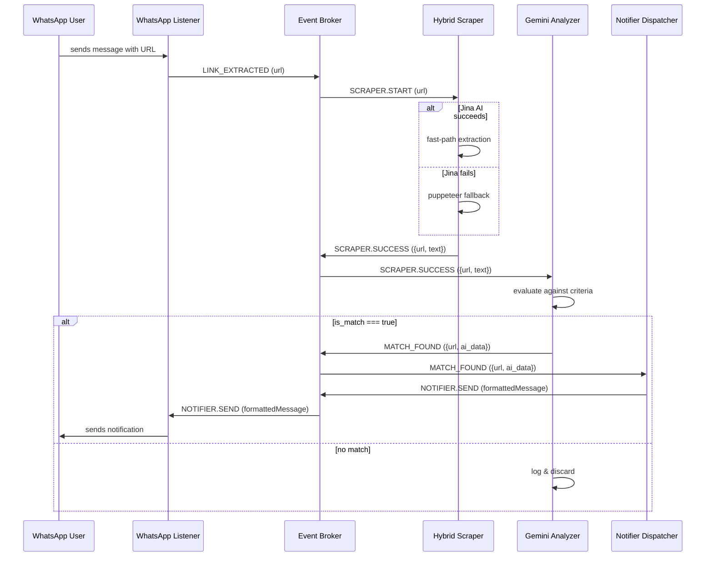
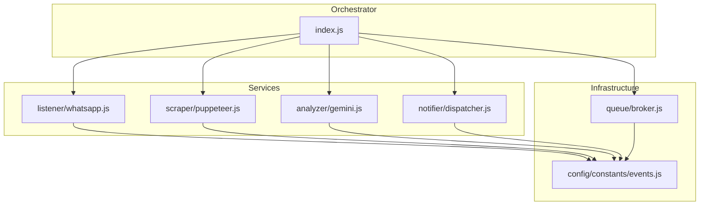
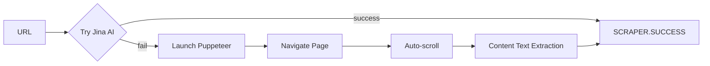
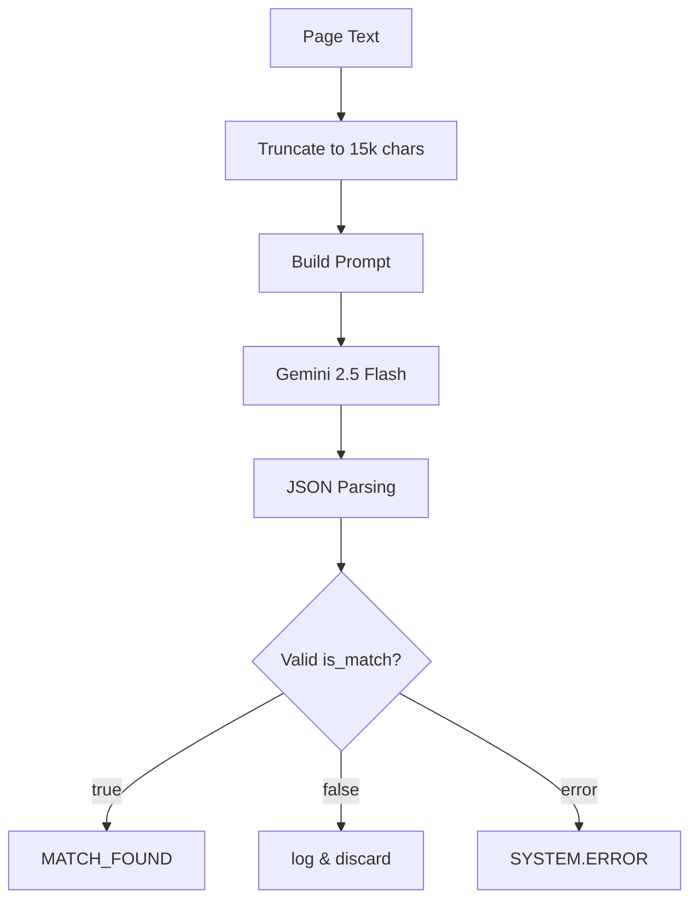
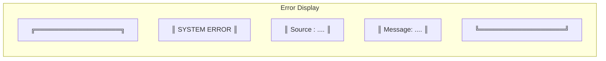
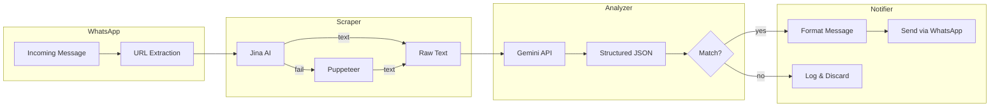

<p align="center">
  <picture>
    <source media="(prefers-color-scheme: dark)" srcset="https://img.shields.io/badge/NORIA-00C9A7?style=for-the-badge&logo=data:image/svg+xml;base64,PHN2ZyB4bWxucz0iaHR0cDovL3d3dy53My5vcmcvMjAwMC9zdmciIHdpZHRoPSI0MCIgaGVpZ2h0PSI0MCIgdmlld0JveD0iMCAwIDI0IDI0IiBmaWxsPSJub25lIiBzdHJva2U9IndoaXRlIiBzdHJva2Utd2lkdGg9IjIiIHN0cm9rZS1saW5lY2FwPSJyb3VuZCIgc3Ryb2tlLWxpbmVqb2luPSJyb3VuZCI+PHBhdGggZD0iTTIgMTJsNC00IDQgNCA0LTQgNCA0IDQtNCIvPjwvc3ZnPg=="/>
  </picture>
</p>

<p align="center">
  <b>A 24/7 event-driven pipeline that listens for scholarship opportunities on WhatsApp, scrapes pages, evaluates eligibility through AI, and delivers matched results back to your phone — automatically.</b>
</p>

<p align="center">
  <a href="https://github.com/AhmadHassan-BTed/Noria/blob/main/LICENSE"></a>
  <a href="https://nodejs.org/"></a>
  <a href="https://github.com/AhmadHassan-BTed/Noria"></a>
  <a href="https://github.com/AhmadHassan-BTed/Noria/stargazers"></a>
</p>

---

## Overview

Noria is named after the Persian water wheel — a continuous, reliable flow of water the same way this pipeline provides a continuous flow of curated scholarship information. It runs 24/7 on a server or Raspberry Pi, listens to WhatsApp messages, extracts URLs, scrapes the linked pages, evaluates them against predefined scholarship criteria using Google's Gemini AI, and delivers a notification when a match is found.

The entire system is decoupled through an event-driven architecture. Each service operates independently and communicates only through a central event broker. No service knows the others exist.

---

## Architecture

### Service Topology



### Event Flow



### Module Dependency Graph



---

## Services

### WhatsApp Listener

Listens for incoming WhatsApp messages using `whatsapp-web.js`. When a message containing a URL is received, it extracts the URL and emits a `LINK_EXTRACTED` event. It also receives `NOTIFIER.SEND` events and forwards the formatted message to the configured phone number.

- **Inbound**: WhatsApp messages via QR authentication
- **Outbound**: `WHATSAPP.LINK_EXTRACTED`
- **Consumes**: `NOTIFIER.SEND`

### Hybrid Scraper

A two-layer content extraction system:



**Layer 1 — Jina AI Reader (fast path):** Sends the URL to `r.jina.ai` for text extraction. Returns clean text in milliseconds without launching a browser.

**Layer 2 — Puppeteer Stealth (slow path):** Falls back to a headless Chrome browser with anti-bot evasion when Jina fails. Blocks unnecessary resource types (images, fonts, stylesheets) for speed. Uses content scoring to find the main article text.

- **Consumes**: `SCRAPER.START`
- **Outbound**: `SCRAPER.SUCCESS` or `SYSTEM.ERROR`

### Gemini Analyzer

Sends extracted page content to Google's Gemini 2.5 Flash model for structured evaluation against a predefined scholarship criteria set:



The model returns a constrained JSON object with `is_match`, `program_name`, `deadline`, and `analysis` fields — enforced at the API level through Gemini's `responseSchema`. The criteria includes citizenship (Pakistani), degree level (Master's), field (CS/SE), and full funding requirement.

- **Consumes**: `SCRAPER.SUCCESS`
- **Outbound**: `MATCH_FOUND` or `SYSTEM.ERROR`

### Notifier Dispatcher

A pure transformation service. Takes the structured match payload from the analyzer and formats it into a WhatsApp-friendly message with bold headers, italic analysis, and timestamp. Has no I/O — just format and emit.

- **Consumes**: `MATCH_FOUND`
- **Outbound**: `NOTIFIER.SEND`

### Event Broker

A singleton `EventEmitter` subclass shared across all services. Responsibilities:

- Raise listener cap to 30 to prevent MaxListenersExceededWarning
- Intercept `SYSTEM.ERROR` globally — renders a formatted error box with source, message, and stack trace
- Print a boot banner on `SYSTEM.BOOTED`



---

## Data Flow



---

## Repository Structure

```
noria/
├── src/
│   ├── index.js                       # Orchestrator — boot & event bridges
│   ├── config/
│   │   └── constants/
│   │       └── events.js              # Immutable event name contracts
│   ├── queue/
│   │   └── broker.js                  # Singleton EventEmitter (the bus)
│   └── services/
│       ├── listener/
│       │   └── whatsapp.js            # WhatsApp client (inbound + outbound)
│       ├── scraper/
│       │   └── puppeteer.js           # Hybrid scraper (Jina + Puppeteer)
│       ├── analyzer/
│       │   └── gemini.js              # AI eligibility evaluator
│       └── notifier/
│           └── dispatcher.js          # Message formatter / transformer
├── docker/
│   ├── Dockerfile
│   └── docker-compose.yml
├── logs/                              # Runtime log output
├── docs/
│   └── assets/                        # Diagrams & supporting files
├── package.json
├── ecosystem.config.js                # PM2 process manager config
└── .env.example
```

---

## Getting Started

### Prerequisites

- **Node.js** 18+ (tested with 20 LTS)
- **npm** or **yarn**
- A **Gemini API key** from [Google AI Studio](https://aistudio.google.com/)
- A **WhatsApp phone number** to receive notifications (can be the same as the sender)
- (Optional) **Jina AI API key** for faster scraping

### Installation

```bash
git clone https://github.com/AhmadHassan-BTed/Noria.git
cd Noria
npm install
```

### Configuration

Copy the environment template and fill in the values:

```bash
cp .env.example .env
```

| Variable          | Required | Description                                                |
| ----------------- | -------- | ---------------------------------------------------------- |
| `GEMINI_API_KEY`  | Yes      | Google Gemini API key for scholarship analysis             |
| `MY_PHONE_NUMBER` | Yes      | Phone number to receive notifications (e.g. +923001234567) |
| `JINA_API_KEY`    | No       | Jina AI key for fast-path content extraction               |
| `NODE_ENV`        | No       | Set to `production` to suppress stack traces               |

### Running

```bash
# Development (direct)
node src/index.js

# Production (via PM2)
pm2 start ecosystem.config.js
```

On first run, a QR code will appear in the terminal. Scan it with WhatsApp on your phone to authenticate the session. The session is persisted in `.wwebjs_auth/` — subsequent restarts won't require re-authentication.

---

## Deployment Options

### Docker

```bash
docker compose -f docker/docker-compose.yml up -d
```

### Raspberry Pi

The hardware detection in the boot sequence automatically sets `PUPPETEER_EXECUTABLE_PATH` to `/usr/bin/chromium-browser` when running on ARM architecture. Install Chromium on the Pi:

```bash
sudo apt install chromium-browser
```

### Process Manager (PM2)

PM2 configuration is included in `ecosystem.config.js`. It restarts the process automatically on crash and supports log rotation.

---

## Event Contract

Every event that flows through the broker is a namespaced string. Services must import from `config/constants/events.js` — magic strings are not used.

| Event                       | Direction             | Payload                             |
| --------------------------- | --------------------- | ----------------------------------- |
| `system.booted`             | Orchestrator → Broker | —                                   |
| `system.error`              | Any → Broker          | `{ source, message, stack?, url? }` |
| `whatsapp.ready`            | WhatsApp → Broker     | —                                   |
| `whatsapp.message_received` | WhatsApp → Broker     | raw Message object                  |
| `whatsapp.link_extracted`   | WhatsApp → Broker     | `url` (string)                      |
| `scraper.start`             | Broker → Scraper      | `url` (string)                      |
| `scraper.success`           | Scraper → Broker      | `{ url, text }`                     |
| `scraper.failed`            | Scraper → Broker      | `{ url, reason }`                   |
| `analyzer.match_found`      | Analyzer → Broker     | `{ url, ai_data }`                  |
| `analyzer.no_match`         | Analyzer → Broker     | `{ url, ai_data }`                  |
| `notifier.send`             | Dispatcher → WhatsApp | `formattedMessage` (string)         |

---

## Design Decisions

- **Decoupled services via event broker**: No service imports another. Every service registers listeners on a shared `EventEmitter`. This means any service can be replaced, removed, or added without touching the others. The orchestrator (`index.js`) is the only place that knows the full topology.
- **Back-to-front initialization**: Services are initialized in reverse pipeline order (dispatcher → analyzer → scraper → whatsapp). This guarantees every downstream listener is registered before any upstream service could emit.
- **Two-layer scraping**: Jina AI for speed (no browser needed), Puppeteer Stealth as a fallback for sites that block AI scrapers. The scraper exits early on Jina success — Puppeteer only launches when necessary.
- **API-level JSON constraint**: Gemini's `responseSchema` forces the model to return valid, structured JSON. The prompt alone is not trusted — the schema is enforced server-side by the API.
- **Fail-fast on missing API key**: The analyzer throws synchronously at init time if `GEMINI_API_KEY` is absent. The process crashes immediately with a clear message rather than silently failing on every evaluation.
- **Hardware-aware boot**: Detects ARM architecture (Raspberry Pi) at startup and routes Puppeteer to the system Chromium binary instead of the bundled one.

---

## License

MIT — see [LICENSE](https://github.com/AhmadHassan-BTed/Noria/blob/main/LICENSE).

---

<p align="center">
  <sub>Built by <a href="https://github.com/AhmadHassan-BTed">Ahmad Hassan (B-Ted)</a></sub>
  <br>
  <sub>Noria — continuous flow of opportunity.</sub>
</p>