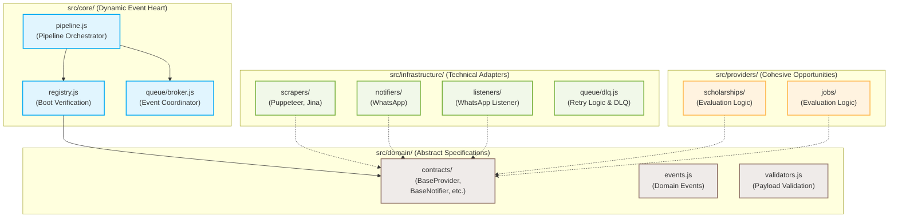
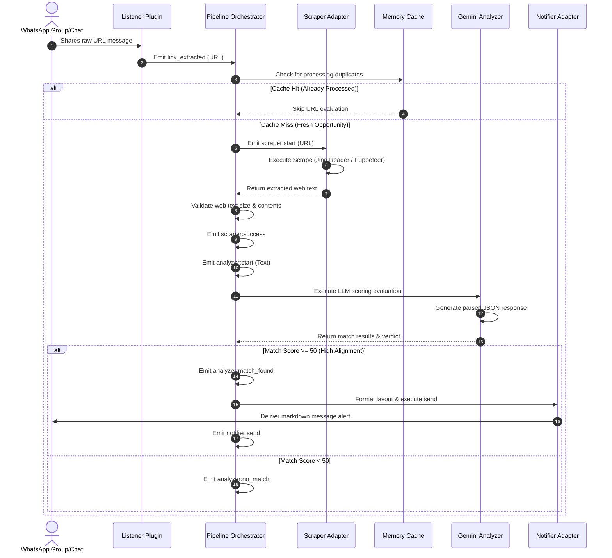

<p align="center">
  
  
  
  
</p>

<h1 align="center">NORIA</h1>

<p align="center">
  <strong>A Decoupled, Event-Driven Pipeline Orchestrator for Opportunity Extraction & Generative Evaluation</strong>
</p>

<p align="center">
  Designed and engineered by <a href="https://github.com/AhmadHassan-BTed">Ahmad Hassan (B-Ted)</a>.
</p>

---

## 🌟 The Vision & Vibe

Opportunities define careers, yet discovery remains a chaotic manual process. Noria was created to bridge this gap. Noria connects humans to life-changing possibilities by crawling raw web pages, executing rigorous AI evaluations against human profiles, and sending real-time alerts. Whether helping students secure fully funded academic scholarships or matching developers with remote job postings, Noria converts raw internet noise into structured opportunities.

---

## 🏛️ Clean Architecture & Boundary Separation

Noria enforces strict Hexagonal Architecture principles. The core orchestrator acts as a pure coordinator, maintaining absolute isolation from external protocols, drivers, or specific AI libraries.

### Module Relationship & Boundaries



---

## 🔄 System Lifecycle & Request Flow

Noria processes raw internet inputs and coordinates executions dynamically through standard domain events:



---

## ⚙️ Statically Enforced Registry Validation

Dynamic verification occurs at boot-time inside the `PluginRegistry` (`src/core/registry.js`). If a class is registered without conforming to the domain specifications, Noria fails fast with an interface violation error:

<details>
<summary><b>🔍 View Enforced Interface Constraints (Collapsible)</b></summary>

| Registry Type | Target Interface Class | Mandatory Signature Methods |
| :--- | :--- | :--- |
| **Provider** | `BaseProvider` | `getAnalyzer()`, `getNotifier()`, `getSchema()`, `getMetadata()` |
| **Listener** | `BaseListener` | `initialize()`, `on(event, cb)`, `close()` |
| **Scraper** | `BaseScraper` | `scrape(url, options)` |
| **Analyzer** | `BaseAnalyzer` | `analyze(content, context)`, `setProvider(provider)` |
| **Notifier** | `BaseNotifier` | `send(target, message)`, `setProvider(provider)`, `format(data)` |

</details>

---

## 📁 Repository Structure

```
noria/
├── .github/                       # CI workflows & issue/PR templates
├── docker/                        # Multi-environment container files
├── docs/                          # Guides & system architecture docs
├── pipelines/                     # Declarative YAML workflow configurations
│   ├── jobs.yaml                  # Crawler stage coordinates for Jobs
│   └── scholarships.yaml          # Crawler stage coordinates for Scholarships
├── src/                           # Platform code
│   ├── config/                    # Environment settings loader
│   ├── core/                      # Core orchestrator and cache systems
│   ├── plugins/                   # Technical communication adapters
│   ├── providers/                 # Opportunity business rules
│   ├── queue/                     # Decoupled global event broker
│   ├── utils/                     # System-wide helper libraries
│   └── index.js                   # Main consolidated entrypoint
└── tests/                         # Unit and integration test suites
```

---

## 🚀 Installation & Quickstart

### 1. Requirements
- **Node.js**: `>=22.12.0` (LTS highly recommended)
- **NPM**: `>=10.0.0`

### 2. Setup
Install the standard dependencies:
```bash
git clone https://github.com/AhmadHassan-BTed/Noria.git
cd noria
npm install
```

### 3. Configure
Create a `.env` file from the template:
```bash
cp .env.example .env
```
Provide the required keys:
```env
GEMINI_API_KEY=your_gemini_api_key
NOTIFICATION_TARGET=your_phone_number
ACTIVE_PIPELINES=scholarships,jobs
```

### 4. Run
Start the orchestrated pipelines:
```bash
npm start
```

---

## 🧪 Developer Workflow & Commands

The project enforces strict quality gates on all contributions. Ensure all local automation checks pass cleanly:

| Command | Objective | Quality Gate Target |
| :--- | :--- | :--- |
| `npm run lint` | ESLint Code Quality | Zero errors or warnings |
| `npm run format:check` | Prettier Layout Verification | Compliant with project styles |
| `npm test` | Jest Unit Tests Execution | All 83 tests passing |
| `npm run test:coverage` | Test Coverage Telemetry | Global coverage must be > 90% |
| `npm run build` | Compile Production Bundle | Successful output in `dist/` |

---

## 🤝 Contributing

Contributions to Noria are welcomed. Please review [CONTRIBUTING.md](docs/CONTRIBUTING.md) and submit a pull request adhering to the review checklist in our [PULL_REQUEST_TEMPLATE.md](.github/PULL_REQUEST_TEMPLATE.md).
